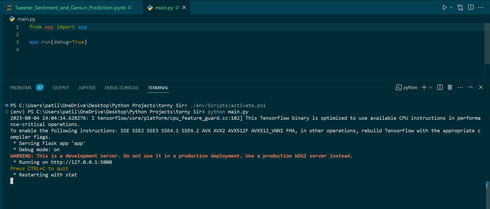
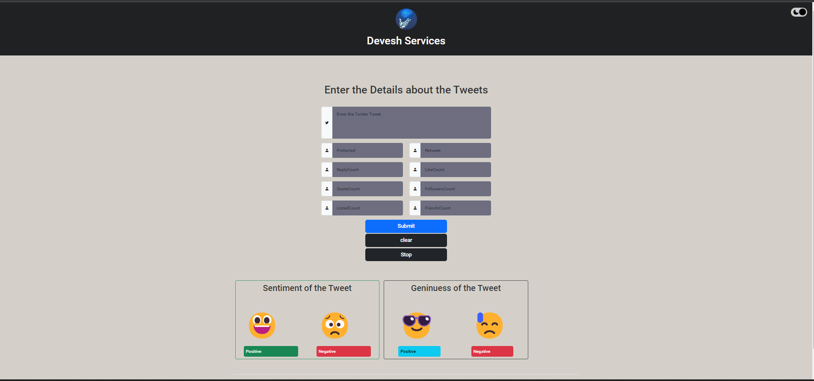

Tweeter Sentiment Prediction Model
===================


Sentiment prediction, a crucial aspect of natural language processing, has been revolutionized by advancements in machine learning and deep learning models. In particular, the integration of Bidirectional Long Short-Term Memory (BiLSTM) networks with Word2Vec algorithms has garnered significant attention. This fusion of techniques enables the model to capture intricate contextual nuances and semantic relationships within text data. BiLSTM, with its ability to analyze sequences bidirectionally, grasps the sequential dependencies of language effectively. Meanwhile, Word2Vec, by representing words as high-dimensional vectors, captures semantic meaning and context. This amalgamation empowers the sentiment prediction model to not only comprehend the sentiment-laden words but also decipher the intricate interplay between them. As a result, this approach has exhibited remarkable performance in sentiment analysis tasks, achieving state-of-the-art results and paving the way for even more sophisticated applications in understanding and processing human emotions through text.

<br>

<p align="center">
Author : 
  <a href="https://github.com/DeveshPatil921">
    @Devesh Patil
  </a>
</p>

I am Starts the Machine Learning and Deep Learing , this project as a part of my studies and practice.

```
✔️ If you think this repository has helped you learn something new you can give a star ⭐ 
❌ If not, point out 'why' and spam the issue section 🚩 
```
<br>

### Setup 

Refer to this [setup video](https://youtu.be/beEBeQw5tpc) to install the dependencies and generate API keys and incorporate with our applications. I've articulated the steps in text format here : 

- Install the dependencies following these steps : 

  - Star this repository (top right corner) 
  - <>Code > Download ZIP > Open cmd/terminal in that location
  - Download the Glove from link : [click me](https://www.kaggle.com/datasets/danielwillgeorge/glove6b100dtxt)
  - Create Virtual Environment : `virtualenv env`
  - Start Virtual Environment : `./env/Scripts/activate.ps1`
  - Create the Directory : `mkdir Assets`
  - move the glove file here : `mv /path/toglove6b100d.txt ./Assets/`
  - Reqiuired packages : `pip install -r requirements.txt`
  - Run this command : `python main.py`

\* The setup for different projects might not be the same. Please refer to the individual setup guides given for each project.

<br>

### Preview

<p align="center">
    <a>
        
        
    </a>
</p>

<br>

